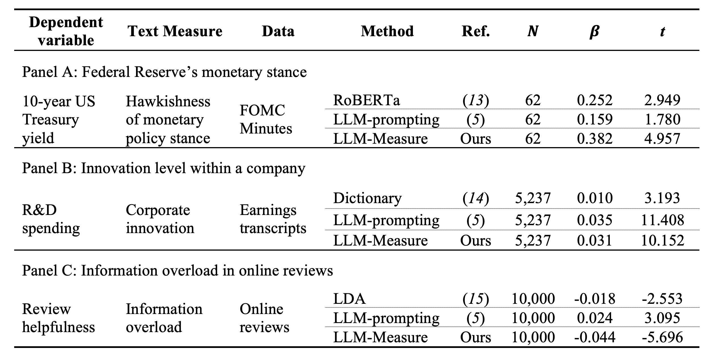

# LLM-Measure: Generating Valid, Consistent, and Reproducible Text-Based Measures for Social Science Research

## Introduction

This repository contains the data, code, and materials required to reproduce the analysis conducted in the research article currently under anonymous review by *Science*.

## Main Results



## Structure of the Repository
- [`figures/`](./figures/): Contains all the plots presented in the submitted manuscript along with the code for generating those plots.
- [`fedMonetaryPolicyStance/`](./fedMonetaryPolicyStance/): Contains all the code (and results) for replicating the experiments conducted in **Study 1: Federal Reserve’s monetary stance**.
- [`corporateInnovation/`](./corporateInnovation/): Contains all the code (and results) for replicating the experiments conducted in **Study 2: Innovation level within a company**.
- [`informationOverload/`](./informationOverload/): Contains all the code (and results) for replicating the experiments conducted in **Study 3: Information overload in social media user comments**.

Within each study folder, there are two subfolders:
  - **`results/`**: Contains the results obtained from running the experiments for the respective study.
  - **`data/`**: Includes the data required to perform the analysis for the respective study.

Additionally:
- The implementation of **LLM-Measure** is provided in the `llm_measure.py` file.
- Other methods, if applicable, are included in additional `.py` files within each study folder.
- We also provide a notebook file, `ols.ipynb`, which presents the results of the regression analysis.


## Data Availability

All data used in this research are accessible either through the `data/` folder under each Study directory or are publicly available online.

### Data Sources

This research is supported by three distinct datasets, each corresponding to a specific study. Descriptions below specify where the data can be accessed:

- **Study 1: Federal Reserve’s Monetary Stance**  
  The dataset for this study consists of Federal Open Market Committee (FOMC) press conference minutes, available for analysis in the [`data/`](./fedMonetaryPolicyStance/data/) directory within the [`fedMonetaryPolicyStance/`](./fedMonetaryPolicyStance/) folder.

- **Study 2: Innovation Level Within a Company**  
  This study uses earnings call transcripts from publicly listed companies, which are available from Seeking Alpha or databases such as Thomson Reuters StreetEvents.

- **Study 3: Information Overload in Social Media User Comments**  
  This study uses a dataset of consumer reviews sourced from TripAdvisor.com. The data is available in the [`data/`](./informationOverload/data/) folder under [`informationOverload/`](./informationOverload/).

If you need further details about the datasets, please refer to the respective folders or databases mentioned.

### Restrictions and Access

The earnings call transcript data is publicly available through financial databases; users should adhere to the policies of these databases when accessing the data. The other two datasets included here are derived from prior studies, which are referenced in the manuscript, and users should adhere to any policies or conditions associated with these datasets as specified by the original sources. There are no additional access restrictions or special permissions required beyond those associated with the original studies.


## Quick Start

To get started quickly with replicating the experiments and analyses, follow these steps:

1. **Implement LLM-Measure, with results saved in the `results/` folder**  
   Applicable to all studies. By default, the script runs the standard version (`-M True`). The following optional parameters introduce variations to the method:
   - `-D True`: Rephrase the definition.
   - `-I True`: Rephrase the instruction.
   - `-P True`: Use 128 probing samples.

   Example commands with optional parameters:
   - To rephrase the definition:
     ```bash
     python llm_measure.py -M False -D True
     ```
   - To rephrase the instruction:
     ```bash
     python llm_measure.py -M False -I True
     ```
   - To use 128 probing samples:
     ```bash
     python llm_measure.py -M False -P True
     ```

3. **Implement LLM-Prompting to conduct the measurement, with results saved in the `results/` folder**  
   Applicable to all studies. By default, the script runs the standard version. The following optional parameters introduce variations to the method:
   - `-D`: Rephrase the definition.
   - `-I`: Rephrase the instruction.

   Example commands with optional parameters:
   - To rephrase the definition:
     ```bash
     python llm_prompting.py -D True
     ```
   - To rephrase the instruction:
     ```bash
     python llm_prompting.py -I True
     ```

4. **Implement LDA to calculate topic entropy of reviews for measuring information overload, with results saved in the [`./informationOverload/results/`](./informationOverload/results/) folder**  
   Specifically for Study 3. Run this script under the [`./informationOverload/`](./informationOverload/) directory:
   ```bash
   python lda.py
   ```

## License

This repository is currently anonymized for review under *Science* and does not have a public license at this time. A specific license will be applied once the review process is complete. For any inquiries regarding the use of the code and data before this license is applied, please contact the corresponding author.


